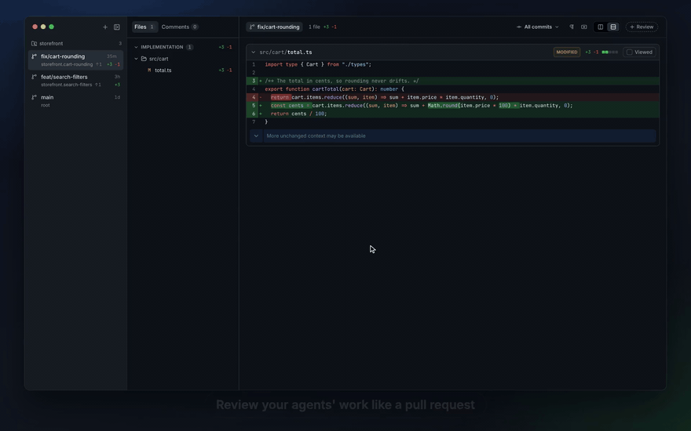

<p align="center">
  
</p>

<h1 align="center">Piccolo</h1>

<p align="center">Review your coding agents' work like a pull request. A Mac app.</p>

<p align="center">
  
</p>

## Install

```bash
curl -fsSL https://raw.githubusercontent.com/jannikbertram/piccolo/main/install.sh | sh
```

Run it again to update.

Optional: with [worktrunk](https://worktrunk.dev) installed (`brew install worktrunk`), Piccolo creates
worktrees with it.
